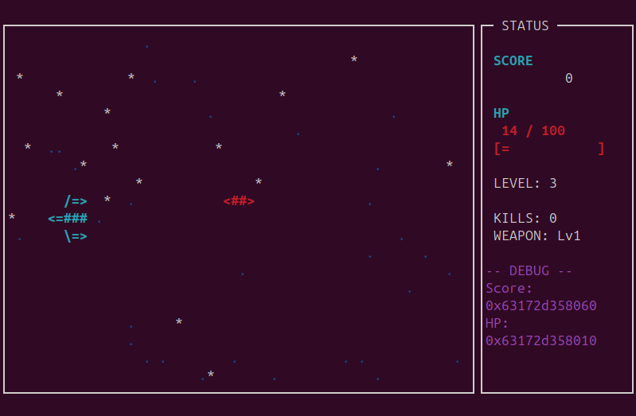

# Stellar Defender - DynaDbg Benchmark

A terminal-based shooting game designed as a benchmark application for testing DynaDbg debugging features.



## Benchmark Purpose

This game is designed to verify the following debugging capabilities:

### 1. Multi-threaded clock_gettime calls (Hardware Breakpoint / Single Step)

- **Threads**: 4 threads
- **Behavior**: Each thread calls `clock_gettime(CLOCK_MONOTONIC, &ts)` at high frequency
- **Testing targets**: 
  - Hardware Breakpoint behavior in multi-threaded environment
  - Thread interference during Single Step execution

### 2. Multi-threaded memory access patterns (Hardware Watchpoint)

- **Threads**: 3 threads
- **Behavior**: High-frequency reads of `g_player_hp`, `g_score`, `g_combo_count`
- **Testing targets**:
  - Memory access detection from multiple threads via Hardware Watchpoint

## Global Variables (For Debugging)

| Variable | Type | Description |
|----------|------|-------------|
| `g_score` | `volatile int32_t` | Current score |
| `g_player_hp` | `volatile int32_t` | Player HP |
| `g_max_hp` | `volatile int32_t` | Maximum HP |
| `g_level` | `volatile int32_t` | Current level |
| `g_enemies_killed` | `volatile int32_t` | Number of enemies killed |
| `g_combo_count` | `volatile int32_t` | Combo count |

## Build

### Using GitHub Actions (Recommended)

1. Clone the repository:
   ```bash
   git clone https://github.com/DoranekoSystems/DynaDbg.git
   cd DynaDbg
   ```

2. Go to **Actions** tab on GitHub

3. Select **Build Benchmarks** workflow

4. Click **Run workflow** and configure options:
   - `linux_x86_64`: Build for Linux x86_64
   - `android_arm64`: Build for Android arm64
   - `shooting_game`: Build shooting_game benchmark

5. Download artifacts from the workflow run

### Local Build (Linux)

```bash
make
```

Or build manually:

```bash
g++ -g -O0 -std=c++17 -pthread -lncurses -o shooting_game shooting_game.cpp
```

## Controls

| Key | Action |
|-----|--------|
| `W` / `↑` | Move up |
| `S` / `↓` | Move down |
| `Space` | Fire |
| `P` | Pause/Resume |
| `M` | Show memory info |
| `Q` | Quit |

## Dependencies

- ncurses
- pthread
- C++17 compatible compiler
